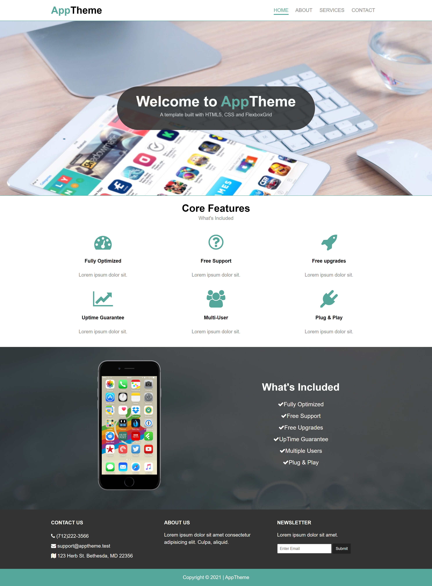
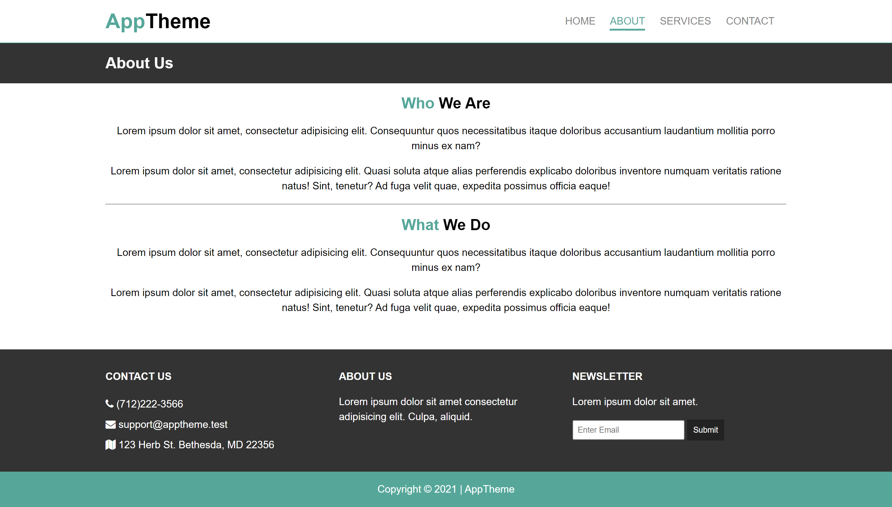
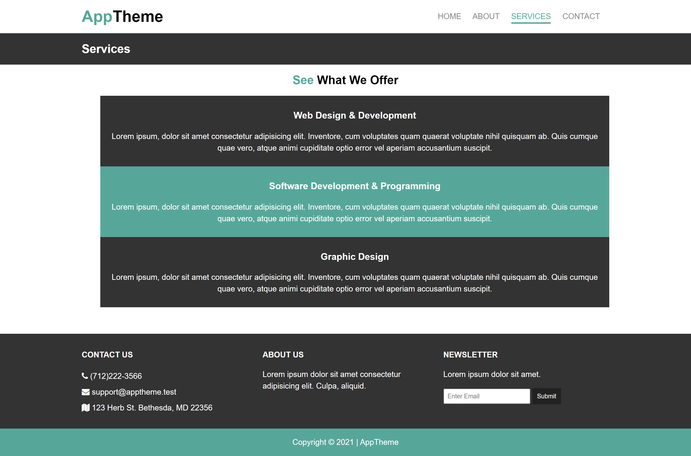
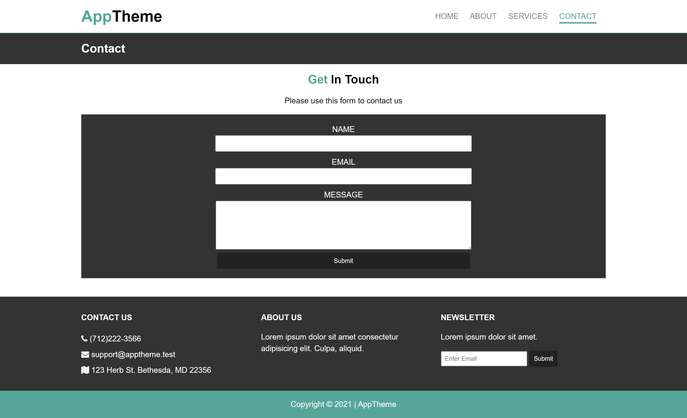

# HTML & CSS - Responsive FlexboxGrid Template

### About

In this project we build a responsive website template using FlexboxGrid which is a lightweight Flexbox based grid system to align our elements. It uses the same classes as the Bootstrap grid.

### Acknowledgement

Thanks to Traversy Media on YouTube for another amazing tutorial.
